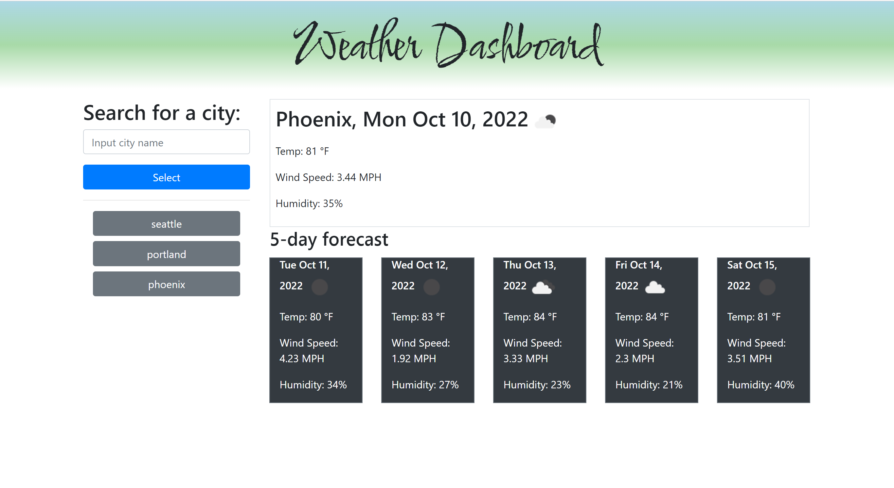

# weather-dashboard
Description:

This repo interacts with the weather API to display current weather patterns for various cities around the country. The user can search a city and the display will pull up today's weather as well as a 5 day forecast. Once a city is searched, it will be printed in a button below the search container so a new city can be plugged in. The user can then re-click old cities to pull their current weather back up.

Installation: N/A

Usage: N/A

Credits: Nathan Alexander

License: Please refer to the license in the repo

Badges: N/A

Features: Form to search for a city. Responsive display to show the current weather in searched city as well as a 5 day forecast. Past searches saved in local storage and presented as clickable buttons. Icons showing current weather.

How to Contribute: N/A

Tests: N/A

Screenshot:

Deployment:
https://nathanalexander1.github.io/weather-dashboard/